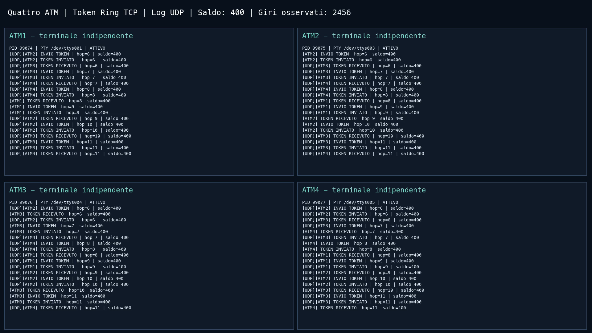
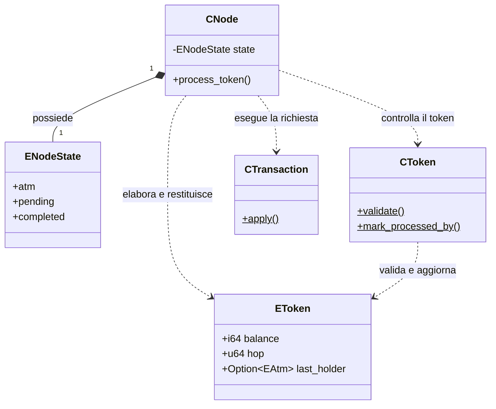
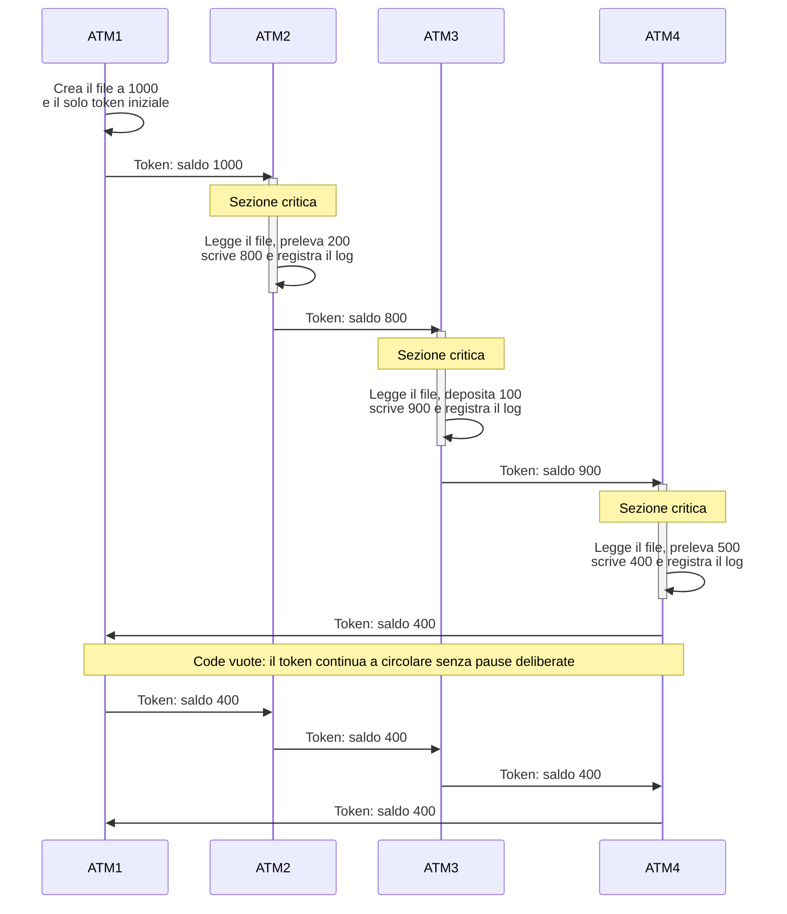

# Sistema di transazioni bancarie distribuite con Token Ring

**Progetto 1 · Intelligenza Artificiale Distribuita · 0322509INGINF05I**

Quattro processi Rust indipendenti simulano altrettanti ATM su `127.0.0.1`. Soltanto il processo che possiede il token può entrare nella **sezione critica protetta**, dove legge il saldo del conto, valida la richiesta, scrive il nuovo saldo e registra la transazione. La mutua esclusione dipende esclusivamente dal Token Ring.

```text
ATM1 → ATM2 → ATM3 → ATM4 → ATM1
```

| Nodo | Operazione iniziale | Saldo ricevuto | Saldo inoltrato |
| --- | --- | ---: | ---: |
| ATM1 | Crea il token, nessuna transazione | 1000 | 1000 |
| ATM2 | Prelievo di 200 | 1000 | 800 |
| ATM3 | Deposito di 100 | 800 | 900 |
| ATM4 | Prelievo di 500 | 900 | **400** |

Dopo le transazioni il token continua a circolare. Un ATM senza richieste lo inoltra subito, senza pause deliberate. Per il token TCP ogni nodo conosce il proprio indirizzo e quello del solo successore. I quattro collegamenti TCP vengono riutilizzati fra i giri: ogni token è un frame JSON terminato da newline. La connessione aperta non concede il permesso di operare. I quattro programmi hanno memoria privata e accedono allo stesso file sotto la protezione del token, senza lock di file o coordinatori. Un canale UDP separato diffonde i log nelle quattro console; le porte dei log non intervengono nella decisione di entrare in sezione critica.

## Installazione e compilazione locale

Gli ambienti nativi supportati sono **macOS e Linux**. Su **Windows usare Ubuntu dentro WSL2**, con gli stessi comandi Linux. Occorrono Git, Bash, curl e un linker C. Su macOS installare le Xcode Command Line Tools; su Debian/Ubuntu eseguire `sudo apt install git curl build-essential xterm`.

Per predisporre Windows, eseguire `wsl --install -d Ubuntu` da PowerShell amministratore e completare il riavvio e la configurazione di Ubuntu. Da quel momento eseguire i comandi della repository **dentro Ubuntu**, preferibilmente nella propria home Linux. Le quattro finestre automatiche richiedono **WSLg** e xterm. Senza ambiente grafico aprire quattro sessioni Ubuntu in Windows Terminal ed eseguire i quattro comandi manuali. [Installazione WSL](https://learn.microsoft.com/en-us/windows/wsl/install), [app grafiche WSLg](https://learn.microsoft.com/en-us/windows/wsl/tutorials/gui-apps).

```bash
git clone https://github.com/cyborg-ai-git/0322509INGINF05I_p1.git
cd 0322509INGINF05I_p1
bash scripts/run_install.sh
bash scripts/run_elaborato.sh
```

`run_install.sh` legge Rust 1.96.0 da `rust-toolchain.toml`, scarica l'installer shell ufficiale se rustup manca, installa rustfmt e Clippy e verifica il linker compilando un piccolo programma. Rispetta `CARGO_HOME` e riutilizza rustup quando è già presente. Se manca un prerequisito, termina con le istruzioni specifiche del sistema. L'installer non installa automaticamente Xcode o pacchetti di sistema.

`run_elaborato.sh` aggiorna il proprio PATH, compila in release e apre quattro console separate:

| Sistema | Terminali avviati |
| --- | --- |
| macOS | Quattro finestre dell'app Terminale tramite AppleScript |
| Linux desktop | Quattro finestre GNOME Terminal, Konsole, XFCE Terminal oppure xterm |
| Windows tramite WSL2/WSLg | Quattro finestre Linux, usando lo stesso launcher Linux |

Su macOS il sistema può richiedere l'autorizzazione ad automatizzare Terminale. Su Linux serve una sessione grafica X11/Wayland e almeno uno dei terminali elencati. Le console restano indipendenti; il launcher non introduce un coordinatore del conto.

Devono essere libere le porte TCP 7001–7004 e UDP 6001–6004. Ogni avvio del launcher crea una cartella `.local/runs/run_…/` e passa ai quattro nodi lo stesso percorso assoluto `shared.txt`. ATM1 inizializza il file a 1000, senza sovrascrivere conti esistenti. Il ritardo delle transazioni è 1500 ms; i nodi inattivi inoltrano sempre subito. Per cambiare porte, scegliere un terminale Linux o vedere i comandi senza aprire finestre:

```bash
bash scripts/run_elaborato.sh --base-port 17001 --log-base-port 16001 --delay-ms 1500
bash scripts/run_elaborato.sh --terminal xterm
bash scripts/run_elaborato.sh --dry-run
```

`--no-build` riutilizza il binario release. Prima di riavviare, interrompere tutti e quattro gli ATM con Ctrl+C. Gli script risolvono la cartella della repository dal proprio percorso e gestiscono nomi contenenti spazi.

Per la sola compilazione, senza avviare finestre, eseguire `cargo build --release`.

Clap gestisce gli argomenti, Serde e serde_json i messaggi, Tokio l'I/O TCP. Criterion serve soltanto ai benchmark. Il logger è incluso nei sorgenti. Per eseguire Cargo manualmente dopo la prima installazione, aprire una nuova shell oppure aggiungere gli eseguibili Rust al PATH della sessione corrente. Questo comando funziona sia in Bash sia in Zsh e rispetta `CARGO_HOME` quando impostata:

```bash
export PATH="${CARGO_HOME:-$HOME/.cargo}/bin:$PATH"
```

## App parametri 

```bash
./target/release/app_atm --help 
```
```bash
Simulazione ATM distribuita con mutua esclusione Token Ring e TCP locale.

Usage: app_atm [OPTIONS] --id <ID> --bind <BIND> --successor <SUCCESSOR>

Options:
      --id <ID>
          Identificativo del nodo: 1, 2, 3 o 4; sono accettati anche gli alias ATM1…ATM4
      --bind <BIND>
          Indirizzo di ascolto su 127.0.0.1; le quattro porte possono essere indipendenti
      --successor <SUCCESSOR>
          Indirizzo del successore nell’anello ATM1 → ATM2 → ATM3 → ATM4 → ATM1
      --transaction <TRANSACTIONS>
          Richiesta FIFO ripetibile, per esempio deposit:100 oppure withdraw:200
      --initial-token
          Obbligatorio per ATM1, vietato per gli altri tre nodi
      --initial-balance <INITIAL_BALANCE>
          Saldo iniziale in unità intere, senza aritmetica in virgola mobile [default: 1000]
      --startup-delay-ms <STARTUP_DELAY_MS>
          Attesa iniziale in millisecondi; i tentativi di connessione gestiscono avvii più lenti [default: 1500]
      --retry-delay-ms <RETRY_DELAY_MS>
          Intervallo fra tentativi di connessione; una scrittura incerta non viene ritentata [default: 500]
      --transaction-delay-ms <TRANSACTION_DELAY_MS>
          Ritardo didattico in millisecondi all’interno della sezione critica attiva. Un nodo inattivo inoltra subito il token, senza pause deliberate [default: 0]
      --account-file <ACCOUNT_FILE>
          File del saldo, identico per tutti i nodi; ATM1 lo crea senza sovrascriverlo [default: shared.txt]
      --log-base-port <LOG_BASE_PORT>
          Prima delle quattro porte UDP dei log, uguale per tutti i nodi [default: 6001]
      --json
          Emette eventi JSONL strutturati nella console
      --audit-file <AUDIT_FILE>
          Nuovo file JSONL facoltativo, scritto esclusivamente da questo nodo
      --console-hop-limit <CONSOLE_HOP_LIMIT>
          Mostra in console solo fino a questo hop; --audit-file conserva tutti gli eventi
  -h, --help
          Print help
  -V, --version
          Print version
```


## Quattro nodi in quattro terminali separati

Aprire **quattro terminali distinti**, tutti nella cartella `0322509INGINF05I_p1`, dopo la compilazione. Le porte TCP **7001–7004** e UDP **6001–6004** devono essere libere. I comandi manuali usano tutti `./shared.txt`, creato da ATM1. Prima di ripetere la prova, arrestare tutti i nodi e conservare il vecchio file con un altro nome oppure scegliere un nuovo percorso uguale per i quattro comandi. Avviare un solo comando per terminale. L'ordine di avvio è libero: il mittente ritenta la connessione al successore prima di scrivere il token.

**Terminale 1 — ATM1**

```bash
./target/release/app_atm --id 1 --bind 127.0.0.1:7001 \
  --successor 127.0.0.1:7002 --initial-token \
  --account-file ./shared.txt --log-base-port 6001
```

**Terminale 2 — ATM2**

```bash
./target/release/app_atm --id 2 --bind 127.0.0.1:7002 \
  --successor 127.0.0.1:7003 --transaction withdraw:200 \
  --account-file ./shared.txt --log-base-port 6001
```

**Terminale 3 — ATM3**

```bash
./target/release/app_atm --id 3 --bind 127.0.0.1:7003 \
  --successor 127.0.0.1:7004 --transaction deposit:100 \
  --account-file ./shared.txt --log-base-port 6001
```

**Terminale 4 — ATM4**

```bash
./target/release/app_atm --id 4 --bind 127.0.0.1:7004 \
  --successor 127.0.0.1:7001 --transaction withdraw:500 \
  --account-file ./shared.txt --log-base-port 6001
```

L’identificativo numerico arriva da `--id`; è accettata anche la forma `ATM1`…`ATM4`. Porta locale e porta del successore sono parametri indipendenti e non devono essere consecutive: collegare sempre i quattro nodi nell’ordine indicato. Solo ATM1 deve ricevere `--initial-token`. Per rendere visibile l'attesa, aggiungere `--transaction-delay-ms 1500` ai nodi con transazioni: il ritardo rimane dentro la sezione critica. Interrompere **tutti e quattro** con Ctrl+C prima di una nuova esecuzione. Un nuovo conto riparte dal saldo iniziale; non riavviare il solo ATM1 mentre un vecchio anello è attivo.

## Video della dimostrazione

[](https://github.com/cyborg-ai-git/0322509INGINF05I_p1/blob/main/media/demo.mp4)

[Guarda il video completo della demo](https://github.com/cyborg-ai-git/0322509INGINF05I_p1/blob/main/media/demo.mp4): quattro processi reali sul Mac, token iniziale, tre transazioni e saldo finale **400**. Il token continua a circolare dopo il completamento delle richieste.

<video controls width="1280px" height="720px">
  <source src="https://github.com/cyborg-ai-git/0322509INGINF05I_p1/blob/main/media/demo.mp4" type="video/mp4">
  Il tuo browser non supporta il tag video.
</video>

## Verifica automatica dello scenario e log

```bash
cargo test --test test_lab \
  quattro_pty_reali_saldo_400_e_tre_giri_verificati -- --exact --nocapture
```

Il test compila il nodo, sceglie quattro porte libere, avvia quattro processi con quattro PTY e verifica tre giri completi, il saldo finale 400 e identità distinte. Arresta i propri figli e usa cartelle temporanee per i log. Non richiede un desktop grafico; per osservare le quattro finestre usare `run_elaborato.sh`.

Il primo giro basta per completare le tre transazioni e ottenere 400. I due giri successivi controllano che il token continui a circolare fra nodi inattivi, senza ripetere le operazioni e senza cambiare il saldo. Tre giri sono una scelta della prova automatica: la traccia richiede circolazione continua, senza fissare un numero di giri.

Gli eventi mostrano **ricezione e inoltro del token, inizio e fine della transazione e saldo aggiornato**. `--json` seleziona JSONL; `--audit-file percorso` crea un file dedicato al nodo senza sovrascrivere evidenze esistenti. Nessun ATM legge i log per coordinarsi.

`--transaction` è ripetibile, per esempio `--transaction deposit:10 --transaction withdraw:5`. Ogni visita consuma una sola richiesta in FIFO locale. Gli importi sono interi positivi; fondi insufficienti e overflow producono un rifiuto con saldo invariato.

## Sezione critica protetta e log UDP

La risorsa condivisa è il saldo bancario; la sezione critica è la sequenza di operazioni protetta dal token. Il file del conto conserva il saldo come unico intero. Dentro la sezione critica il nodo legge il file, valida l’operazione, scrive il nuovo valore e registra l’esito prima di inoltrare il token. La scrittura usa un temporaneo nella stessa directory e un rename; l’esclusione fra ATM resta affidata unicamente al token. Il campo balance del token è una copia diagnostica dell’ultimo saldo scritto e viene confrontato con il file: non sostituisce la lettura del conto.

Ogni nodo ascolta i log sulla porta UDP `base + id - 1` e ne invia copie agli altri tre. Questo broadcast applicativo usa datagrammi unicast su localhost. Le righe `[UDP][ATM…]` mostrano gli eventi remoti; il log del nodo è stampato direttamente, senza duplicarlo. UDP può perdere o riordinare eventi, quindi le verifiche usano gli audit locali completi. In modalità `--json` le copie ricevute hanno evento `remote_log` e il record originale nel campo `source`.

## Test e documentazione delle API

I test si eseguono sul workspace Rust e comprendono quattro processi ATM reali. Su Windows eseguirli dentro Ubuntu in WSL2.

```bash
cargo fmt --all --check
cargo clippy --workspace --all-targets -- -D warnings
cargo test --workspace
cargo build --release
RUSTDOCFLAGS='-D warnings' cargo doc --workspace --no-deps --open
```

Sono presenti **60 test Rust e un esempio rustdoc eseguibile**. I file dei test d'integrazione hanno prefisso `test_`; i benchmark hanno prefisso `bench_`. I commenti rustdoc italiani descrivono responsabilità, precondizioni, errori e invarianti. I controlli `missing_docs` e `rustdoc::broken_intra_doc_links` impediscono API pubbliche prive di documentazione e riferimenti non validi.

I **13 benchmark Criterion** si eseguono con `cargo bench`. Misurano transazioni, elaborazione del token, codec, file del conto, invio UDP e due modalità TCP: apertura di un nuovo collegamento e trasferimento sul canale già aperto, come nel programma. Nessuna delle due rappresenta un giro completo dell’anello. Il benchmark con apertura distanzia le connessioni con una pausa di preparazione di 5 ms esclusa dal tempo misurato, per limitare il consumo delle porte effimere. Misura la latenza di trasferimenti isolati. I risultati sono generati in `target/criterion/`; dipendono dall’host e dal carico e non sono garanzie temporali.

## Limiti del modello

Il sistema assume quattro nodi cooperanti. TCP e i metadati del token non autenticano i processi locali. Un crash può fermare l'anello: il token non viene rigenerato su timeout e una scrittura incerta non viene ripetuta. Se una porta locale è temporaneamente indisponibile prima della connessione, il mittente conserva il token e ritenta l’apertura, senza reinviare dati già scritti. Il file conserva l’ultimo saldo scritto, ma il progetto non riprende automaticamente un anello interrotto: il bootstrap richiede un file nuovo. Mutua esclusione e verifica di un'esecuzione finita non implicano disponibilità bancaria reale o durabilità ACID.

## Diagrammi UML

### Strutture del singolo nodo

Il rombo indica lo stato posseduto dal nodo; le frecce tratteggiate rappresentano dipendenze. Le classi UML descrivono strutture Rust, senza ereditarietà o memoria condivisa tra processi. Sono riportati soltanto i membri principali.



### Sequenza dello scenario richiesto

Ogni partecipante è un processo distinto. Le barre di attivazione mostrano sezioni critiche disgiunte: aggiornamento e log precedono sempre l’invio del token. Il successivo giro con saldo 400 mostra l’inoltro da parte dei nodi inattivi.



## Struttura e file locali

| Percorso | Contenuto pubblicato |
| --- | --- |
| `src/` | Nodo ATM, modello bancario, controlli, file del conto, TCP e log UDP |
| `tests/test_*.rs` | Prove di integrazione, processi reali e isolamento dei PTY |
| `tests/support/` | Libreria Rust usata soltanto dai test, senza eseguibile autonomo |
| `tests/fixtures/test_echo_node.rs` | Processo Rust minimo usato per verificare l’indipendenza delle console |
| `benches/bench_*.rs` | Benchmark Criterion |
| `scripts/` | I soli cinque file necessari all’installazione e all’avvio |
| `media/` | Video MP4 finale e screenshot |
| `.github/workflows/ci.yml` | Controlli automatici su macOS e Linux |

In `scripts/` sono versionati soltanto `run_install.sh`, `run_elaborato.sh`, `run_node.sh`, `run_common.sh` e `run_macos.applescript`. I primi due sono i punti di ingresso; gli altri tre servono al launcher. Cargo.toml e rust-toolchain.toml definiscono pacchetti, requisiti delle dipendenze e toolchain.

`Cargo.lock` è generato da Cargo e conservato soltanto localmente, escluso da `.gitignore`. Le versioni dichiarate nei manifest sono requisiti SemVer: due nuove installazioni possono risolvere versioni compatibili diverse, incluse le dipendenze transitive. La CI verifica ogni modifica partendo da un clone senza lockfile.


Licenza del progetto: [MIT](LICENSE.txt).
